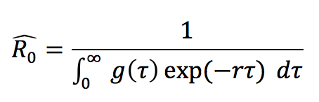
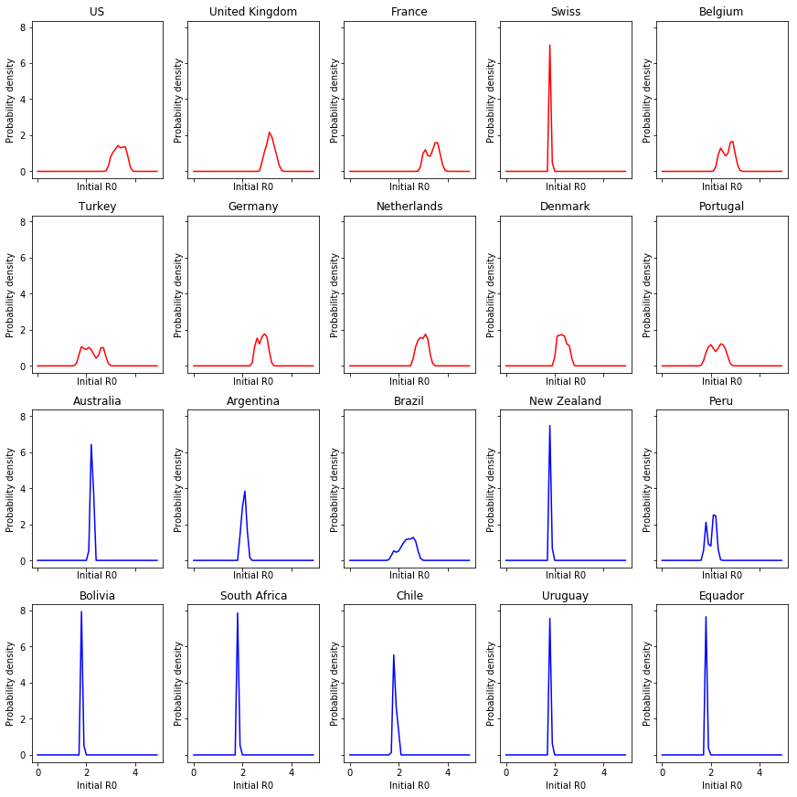

Many viral infections are known to have a seasonal component. The three main reasons usually referenced for this seasonality in viral infections include:

* Changes in the contact network due to seasonal human activity (e.g., think of schools closing in the summer etc.)
* More time spent outdoors during summer months that might hinder the transmission of the virus compared to indoors 
* Many viruses wither under high temperature

While there are speculations that summer months will slow down the effective reproduction of COVID-19, there is no evidence that we should anticipate this (especially since we have already changed our contact patterns for example). However, we might be able to get <I>some</I> idea of what to anticipate by examining the initial period of the pandemic in countries at the north and south hemisphere. In particular, if we can estimate the inital reproduction number during the initial phase (e.g., first 30 days), prior to any hard measures taken (that differ from country to country), we can possibly get an idea of what to anticipate in the north hemisphere during summer months. 

For estimating the initial reproductive number during the first period of the pandemic we used the Euler-Lotka equation that provides an estimate for R0 as [[1]](#1):

where g(τ) is the generation time distribution and r is the growth rate during the initial phase of the pandemic (typically first 30 days [[2]](#2)). From the pieces that the above equation needs we can obtain estimates for the generation time distribution [[3]](#3), while we can estimate the initial growth rate from incidence data. Now the incidence data are very noisy and a better approach might be to use the fatality counts – which theoretically are less noisy. Fatality counts will have a temporal lag on the number of incidences that they imply, so we should also account for that. In particular, if we utilize the fatality counts at day D, we can get an estimate of the incident counts approximately two weeks earlier. This means that if we want to examine the period before severe lockdowns and measures, we should examing the progression of the virus approximately up to the first week of March. This means that we can use the fatality counts around 3/20. For this we also need to assume an infection fatality rate. We used a gamma distribution with average of 3.9 days for the generation time, while we performed several simulations with an IFR choosen uniformly at random between 0.5% and 1%, and a fatality count choosen uniformly at random from the period between 3/17 and 3/24. We compared 10 countries from the north hemisphere and 10 countries from the south (or mainly in the south) hemisphere and following are the results: 

 

Countries at the top 2 rows are countries at the north hemisphere, while countries in the bottom 2 rows are countries in the south hemisphere (or mainly in the south - e.g., Equador, Brazil). As we can see the reproductive number - as per the Euler-Lotka equation - during the initial state of the epidemic was lower in the countries in the south hemisphere. The average median R0 for north countries is 2.7, while for south hemisphere countries is 2 (p-val < 0.01). More results (quantiles of these estimations) are provided in the repo's notebook. 
  
Of course, there are many reasons that might have led to these different observations including severe differences in reproting covid-19 fatalities, differences in the IFR across countries that make the uniform sampling used not appropriate, differences in the onset of the epidemic in these countries etc., but these result seem to suggest that there might be a seasonal component to COVID-19, similar to other viral infections. However, this is very important particularly for the upcoming fall and it is one of the main concerns of epidemiologists I have talked with. <B>Seeing a possible slow-down of the virus during the summer does not mean that we are "done" with it. We need to be vigilant during the upcoming fall and not be complacent of a "summer victory".</B>    

## References
<a id="1">[1]</a> 
Nishiura, Hiroshi (2010). 
Correcting the actual reproduction number: a simple method to estimate R0 from early epidemic growth data. 
International journal of environmental research and public health 7.1, pp 291-302.

<a id="2">[2]</a>
Obadia, Thomas, Romana Haneef, and Pierre-Yves Boëlle (2012).
The R0 package: a toolbox to estimate reproduction numbers for epidemic outbreaks.
BMC medical informatics and decision making 12.1, p 147.

<a id="3">[3]</a>
Du, Zhanwei, et al. (2020).
The serial interval of COVID-19 from publicly reported confirmed cases.
medRxiv.
